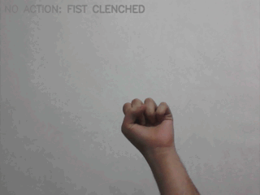

# Virtual Air Canvas 🎨

[](https://opensource.org/licenses/MIT)

A real-time virtual drawing application built with **OpenCV** and **MediaPipe**. This project detects hand gestures to allow users to draw, erase, and pause on a virtual canvas directly through the webcam.

## 🖼️ Demo



## 🚀 Features

-   **Live Drawing**: Draw on the canvas by moving your index finger.
-   **Gesture Control**: Use simple hand gestures to control the drawing process.
-   **Erase Canvas**: Clear the entire canvas with a specific hand pose.
-   **Pause Drawing**: Stop drawing without losing your progress.
-   **Smart Line Breaks**: The application intelligently handles the start and end of drawing strokes.

## 🎮 Controls & Gestures

The application recognizes the following hand gestures:

| Gesture                 | Action                |
| :---------------------- | :-------------------- |
| **Index Finger Up Only**  | 🟢 **Draw** |
| **All Fingers Up**        | 🔴 **Erase Canvas**  |
| **Pinky Finger Up**       | 🟠 **Pause**         |
| **Fist (All Bent)** | ⚫ **Wait/No Action**  |

## 📦 Installation

To get this project up and running, follow these steps:

1.  **Clone the repository:**
    ```bash
    git clone https://github.com/MjavadH/virtual-air-canvas.git
    cd virtual-air-canvas
    ```

2.  **Install the required dependencies:**
    ```bash
    pip install -r requirements.txt
    ```

## ▶️ How to Use

Once the installation is complete, run the main script:

```bash
python src/main.py
```
Hold your hand in front of the webcam and use the defined gestures to start drawing. Press the `q` key to exit the application.

## 🧠 How it Works
This project uses **MediaPipe Hands** to track 21 hand landmarks. The drawing logic is based on geometric checks:
- **Drawing Mode:** Activated when only the Index finger is up (tip y < pip y).
- **Smooth Lines:** A `deque` data structure stores the coordinates to draw continuous lines and handle breaks efficiently.

## 📜 Requirements

-   [OpenCV](https://pypi.org/project/opencv-python/)
-   [NumPy](https://pypi.org/project/numpy/)
-   [MediaPipe](https://pypi.org/project/mediapipe/)

## 📄 License

This project is licensed under the MIT License. See the [LICENSE](LICENSE) file for details.